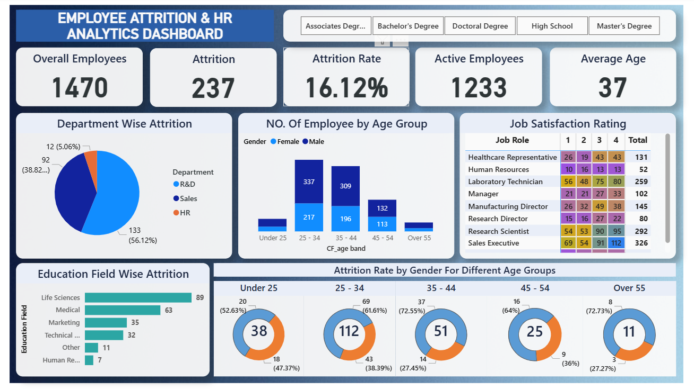

# 👨🏻‍💻Employee-Attrition-HR-Analytics-DashBoard
The Employee Attrition & HR Analytics Dashboard is a data analytics project designed to analyze employee attrition patterns and workforce dynamics. The dashboard helps HR teams and business stakeholders understand key factors influencing attrition and supports data-driven decision-making to improve employee retention.
This project demonstrates practical application of data analysis, data modeling, and interactive dashboard development using Power BI.

## 🎯 Project Overview
- Analyze overall employee attrition and retention
- Identify departments with high attrition rates
- Understand attrition trends by age group and gender
- Evaluate job satisfaction across job roles
- Provide actionable insights for HR strategy and workforce planning

## 🛠️ Tools & Technologies
- Power BI – Interactive dashboard development and visualization
- Power Query – Data cleaning and transformation
- DAX – Calculated measures and KPIs
- Visuals – Cards, bar charts, pie charts, donut charts, matrix
- Slicers – Interactive filtering by employee attributes
- Dataset – Cleaned and structured HR data

## 🧹 Data Preparation
- Imported the raw HR dataset from Excel into Power BI
- Performed data cleaning using Power Query
- Removed duplicate records and validated employee IDs
- Handled missing and inconsistent values across key attributes
- Standardized data types (numeric, text, date fields)
- Created derived columns such as Age Group and Attrition Status
- Renamed columns for clarity and business relevance
- Filtered irrelevant or redundant fields to optimize the data model
- Ensured data integrity before visualization and analysis

## 📊 Dashboard Features
- Interactive KPI Cards – Displays key metrics such as Total Employees, Active Employees, Attrition Count, Attrition Rate, and Average Age for quick decision-making
- Department-wise Attrition Analysis – Visual comparison of attrition across departments to identify high-risk business areas
- Age Group & Gender Analysis – Breakdown of employee distribution and attrition trends across age bands and gender categories
- Education Field-wise Attrition – Highlights attrition patterns based on educational background to support targeted HR strategies
- Job Satisfaction Analysis – Role-wise job satisfaction insights to identify potential attrition drivers
- Dynamic Slicers – Allows filtering by education level and other employee attributes for focused analysis
- User-Friendly Layout – Clean, intuitive dashboard design for easy navigation and interpretation
- Real-Time Interaction – Visuals update instantly based on slicer selections for deeper insight exploration

## 📷 Dashboard Preview

 

## 👨‍💻 Author
🌸 Hey, I'm Sarada Behera.
Aspiring Data Analyst | Excel | SQL | Power BI | Python

💼 LinkedIn: [Sarada Behera](www.linkedin.com/in/sarada-behera13)

📫 Email: beherasarada13@gmail.com
